# aeron-artio-fix

A FIX 4.2 / 4.4 gateway built on [Artio](https://github.com/artiofix/artio) that receives messages
from other FIX engines and republishes them into [60East AMPS](https://www.crankuptheamps.com/) **as
the raw bytes that came off the session** — SOH-separated `tag=value`, never re-encoded, never turned
into a `String` on the way. Around that: a converter that turns QuickFIX/J FIX dictionaries into
Artio dictionaries and generates codecs from them at build time, a QuickFIX/J counterparty to play
"the other engine", an AMPS instance run with podman compose plus a test harness that starts a
throwaway one per suite, and the whole runtime packaged twice — as a plain-Java main and as a Spring
Boot application — because "can this run under Spring Boot?" was one of the questions.

## Architecture

```
  ┌──────────────────────┐                          ┌─────────────────────────────────────────────┐
  │  QuickFIX/J          │      FIX 4.2 / 4.4       │  :artio-engine   (one JVM, one poll thread) │
  │  counterparty        │◄────────────────────────►│                                             │
  │  initiator/acceptor  │        over TCP          │   ArchivingMediaDriver ─┐                   │
  │  :quickfixj-         │         :9880            │   FixEngine  ───────────┼── Aeron IPC       │
  │   counterparty       │                          │   FixLibrary ───────────┘   (shared memory) │
  └──────────────────────┘                          │        │                                    │
                                                    │        ▼  FixMessageView (zero-copy          │
                                                    │           flyweight over Aeron's buffer)     │
                                                    │      FixMessageSink                          │
                                                    └────────────┬────────────────────────────────┘
                                                                 │  copy, no allocation
                                                                 ▼
                                              ┌──────────────────────────────────────┐
                                              │  :artio-amps-bridge                  │
                                              │   OneToOneRingBuffer (off-heap, 4MiB)│
                                              │            │                         │
                                              │            ▼   publisher agent thread │
                                              │       TopicRouter → reusable byte[]  │
                                              └────────────┬─────────────────────────┘
                                                           │  AMPS protocol over TCP
                                                           │  tcp://localhost:9007/amps/fix
                                                           ▼      (MessageType = fix)
  ┌────────────────────┐                    ┌───────────────────────────────────────────┐
  │ sowDump            │─── SOW query ─────►│  AMPS  (:amps-server, podman)             │
  │ admin UI :8085     │─── HTTP ──────────►│   fix.orders       SOW key /11  ClOrdID   │
  └────────────────────┘                    │   fix.execs        SOW key /17  ExecID    │
                                            │   fix.order.state  SOW key /37  OrderID   │
                                            │   fix.raw          journalled, no SOW     │
                                            │   fix.admin        pub/sub, optional      │
                                            └───────────────────────────────────────────┘

  :artio-spring-boot wraps the boxed region above — engine + bridge — in a Spring context,
  adding property binding, profiles, a fat jar and two SmartLifecycle phases for start/stop order.
```



```mermaid
flowchart LR
    QFJ["QuickFIX/J counterparty<br/>quickfixj-counterparty"]

    subgraph ENGINE["artio-engine — Aeron IPC"]
        MD["ArchivingMediaDriver"]
        FE["FixEngine"]
        FL["FixLibrary<br/>poll thread"]
        MD --- FE --- FL
    end

    SINK["FixMessageSink<br/>zero-copy FixMessageView"]

    subgraph BRIDGE["artio-amps-bridge"]
        RB["OneToOneRingBuffer<br/>off-heap, 4 MiB"]
        PUB["publisher agent<br/>TopicRouter"]
        RB --> PUB
    end

    subgraph AMPS["AMPS — amps-server, podman"]
        T1["fix.orders — SOW key /11"]
        T2["fix.execs — SOW key /17"]
        T3["fix.order.state — SOW key /37"]
        T4["fix.raw — journalled, no SOW"]
    end

    DUMP["sowDump / admin UI on 8085"]
    BOOT["artio-spring-boot<br/>wraps engine + bridge"]

    QFJ <-->|"FIX 4.2 / 4.4 over TCP, port 9880"| FL
    FL --> SINK --> RB
    PUB -->|"AMPS protocol over TCP<br/>tcp://host:9007/amps/fix, message type fix"| AMPS
    AMPS -.->|"SOW query / HTTP"| DUMP
    BOOT -.-> ENGINE
    BOOT -.-> BRIDGE
```

## Modules

| Module | Purpose | README |
| --- | --- | --- |
| `fix-dictionary` | Reads a QuickFIX/J FIX dictionary, writes an Artio one, and explains every change. Library + CLI. | [README](fix-dictionary/README.md) |
| `fix-codecs` | Artio encoders, decoders and `FixDictionaryImpl` for FIX 4.2 and 4.4, generated at build time. | [README](fix-codecs/README.md) |
| `artio-engine` | The engine itself: media driver, archive, `FixEngine`, `FixLibrary`, one poll thread, behind one `AutoCloseable`. Acceptor or initiator. | [README](artio-engine/README.md) |
| `quickfixj-counterparty` | "The other FIX engine" — a QuickFIX/J initiator and acceptor for tests and demos. | [README](quickfixj-counterparty/README.md) |
| `amps-server` | The AMPS instance: flow config, compose file, lifecycle script, container recipe. No Java. | [README](amps-server/README.md) |
| `amps-test-harness` | A throwaway AMPS per integration suite, via podman compose, skipping cleanly when it cannot run. | [README](amps-test-harness/README.md) |
| `artio-amps-bridge` | The publisher: ring-buffer hand-off, topic routing, reconnect. Plus `run` and `sowDump` mains. | [README](artio-amps-bridge/README.md) |
| `artio-spring-boot` | The same engine and bridge as a Spring Boot application, and the feasibility answer. | [README](artio-spring-boot/README.md) |

Compile-time dependency graph:

```
fix-dictionary ──> fix-codecs ──> artio-engine ──> artio-amps-bridge ──> artio-spring-boot
                                     ▲                    ▲
quickfixj-counterparty (tests) ──────┘                    │
amps-test-harness (integrationTest only) ─────────────────┘
amps-server (no code: config + scripts, read by the harness)
```

Root package `com.demo.artio`, one sub-package per module (`dictionary`, `fix42`/`fix44`, `engine`,
`qfj`, `testharness`, `bridge`, `boot`).

## Quick start

**The AMPS image.** There is no public AMPS server image — 60East ships the server as a licensed
release tarball — so nothing here pulls from a registry. The default is
`localhost/amps-demo:5.3.5.135`, built by the sibling `amps-demo` project. To build one here
instead, drop a release tarball in [`amps-server/vendor/`](amps-server/vendor/README.md) and follow
the recipe in `amps-server/Containerfile`. Override with `AMPS_IMAGE=…` on any command.

```bash
amps-server/scripts/amps.sh start     # AMPS in podman, artio-fix flow; blocks until it is ready
./gradlew build                       # everything, including integration tests where AMPS is up
```

Then run the demo: [`docs/05` section 9](docs/05-integration-testing-and-demo.md#9-demo-runbook) has
it end to end with real output. In brief, one process at a time from the repository root:

```bash
./gradlew :artio-spring-boot:bootRun                          # acceptor on 9880 + the AMPS bridge
./gradlew :quickfixj-counterparty:run --args="initiator --host localhost --port 9880 \
    --version FIX.4.2 --sender QFJ --target ARTIO --scenario orders"
./gradlew :artio-amps-bridge:sowDump --args="--topic fix.orders"   # 5 records, keyed by ClOrdID
./gradlew :artio-amps-bridge:sowDump --args="--replay fix.raw"     # the journal
# Ctrl-C the bootRun (Gradle reports exit 143; that is SIGTERM, not a failure)
amps-server/scripts/amps.sh down
```

`./gradlew :artio-amps-bridge:run` is the same flow without Spring. The AMPS admin UI is at
<http://localhost:8085/>.

Two results in that run surprise people, and both are correct: **five SOW records for three
orders** (a cancel/replace carries a new `ClOrdID`, so `fix.orders` holds one record per *request*),
and **zero execution reports** (an Artio gateway receives and republishes; it does not book or fill —
point the initiator at `quickfixj-counterparty acceptor` to see the eight replies).

## The three JVM flags

Every JVM in this build sets these, and so must anything that embeds the engine:

```
--add-opens   java.base/jdk.internal.misc=ALL-UNNAMED
--add-exports java.base/jdk.internal.misc=ALL-UNNAMED
--add-opens   java.base/sun.nio.ch=ALL-UNNAMED
```

The first two are agrona 2.0.1's: `UnsafeApi` reaches `jdk.internal.misc.Unsafe`, and every
generated Artio codec allocates an `UnsafeBuffer` in its constructor, so the first `new
NewOrderSingleEncoder()` throws `IllegalAccessError` without them. The third is Artio's:
`ReceiverEndPoints` reflects on `sun.nio.ch.SelectorImpl.selectedKeys` in a **static initialiser**,
so without it `FixEngine.launch` dies with `NoClassDefFoundError: Could not initialize class …
ReceiverEndPoints` — a message that names neither the flag nor the real cause. `java -jar` and
containers have nowhere to get them from but the command line or `JAVA_TOOL_OPTIONS`.

(`:fix-dictionary` sets none of them and needs none: it parses XML.)

## Tests

Two suites per module that needs one:

* **`test`** — unit. No containers, no external ports, nothing on disk outside `build/`. Always runs.
* **`integrationTest`** — its own source set and task, with `check` depending on it. Real engines on
  loopback ports from `ServerSocket(0)`, and for some modules a real AMPS.

Anything that needs AMPS calls `AmpsAssumptions.assumeAvailable()` and **skips with a reason** when
it cannot run — `AMPS_IT=false`, no container engine on `PATH`, no usable compose implementation, or
`<engine> image inspect` saying the image is not known. Everything else in `integrationTest` passes
with no AMPS present, so `./gradlew build` stays green on a machine that has never seen it.

The corollary: **a green build is not proof the AMPS suites ran.** Look for `0 skipped`. And because
Gradle cannot see whether podman is running or a port is free, every `integrationTest` task uses
`doNotTrackState(...)` — not merely `upToDateWhen { false }`, which leaves the task *cacheable* and
lets a previous all-skipped run be restored as `FROM-CACHE`. Asking for the task runs it.

| Module | `test` | `integrationTest` |
| --- | ---: | ---: |
| `fix-dictionary` | 81 | — |
| `fix-codecs` | 12 | — |
| `artio-engine` | 54 | 44 |
| `quickfixj-counterparty` | 65 | 12 |
| `amps-test-harness` | 37 | 11 |
| `artio-amps-bridge` | 85 | 4 |
| `artio-spring-boot` | 37 | 3 |

## Documents

| | |
| --- | --- |
| [`docs/00-implementation-plan.md`](docs/00-implementation-plan.md) | the plan the build was made from: verified facts, module layout, conventions, phases and their outcomes |
| [`docs/01-artio-engine-design.md`](docs/01-artio-engine-design.md) | the engine as built — topology, threads, directories, session lifecycle, the sink contract, sending, reconnect, shutdown |
| [`docs/02-quickfixj-to-artio-dictionary.md`](docs/02-quickfixj-to-artio-dictionary.md) | the two dictionary formats compared, every conversion rule with the failure that motivated it, build-time generation |
| [`docs/03-artio-amps-bridge-design.md`](docs/03-artio-amps-bridge-design.md) | the ring-buffer hand-off, overflow policy, topic routing, the port and reconnect, allocation profile, measured throughput |
| [`docs/04-spring-boot-feasibility.md`](docs/04-spring-boot-feasibility.md) | can it run under Spring Boot? Yes — with the thread-ownership, lifecycle-ordering and fat-jar constraints spelled out |
| [`docs/05-integration-testing-and-demo.md`](docs/05-integration-testing-and-demo.md) | how podman compose is driven, readiness detection, the skip rules, and the **demo runbook** with real output |
| [`docs/06-code-review.md`](docs/06-code-review.md) | the review record: 54 findings across five modules, and how each was resolved |
| [`docs/aeron_artio_amps_analysis.md`](docs/aeron_artio_amps_analysis.md) | the background analysis this project started from |

## What was learned

Six findings that cost real time and are not in anyone's documentation:

1. **AMPS does not reject a SOW publish that lacks the topic's key — it silently collapses them.**
   The folklore (and this project's own plan, before it was probed) said such a publish is rejected.
   On 5.3.5.135 with `MessageType fix` it is accepted, logs nothing, tells the publisher nothing, and
   is stored under one degenerate key shared by *every* keyless message: publish three, keep one. So
   there is no server-side guard to mirror, and the bridge's "require tag 37 before routing to
   `fix.order.state`" rule is a **correctness requirement** rather than a precaution. Pinned by
   `SowKeyBehaviourIT`; written up in [`docs/05` section 8.1](docs/05-integration-testing-and-demo.md).

2. **The third JVM flag.** Agrona's two `jdk.internal.misc` flags are well known. Artio needs a third,
   `--add-opens java.base/sun.nio.ch=ALL-UNNAMED`, because `ReceiverEndPoints` reflects on
   `SelectorImpl.selectedKeys` in a static initialiser — and a failure in a static initialiser
   surfaces as `NoClassDefFoundError: Could not initialize class …` on the *second* attempt, naming
   neither the flag nor the field. Under Spring it reads as a bean-factory problem. It is not.

3. **QuickFIX/J's stock dictionaries are already near-valid Artio dictionaries.** The two formats are
   the same XML schema, and converting QuickFIX/J's shipped FIX 4.2 and 4.4 produced exactly **one**
   change between them (a `UTCDATE` type alias Artio spells `UTCDATEONLY`). The fifteen conversion
   rules in [`docs/02`](docs/02-quickfixj-to-artio-dictionary.md) exist for the *venue* dictionaries
   you get handed, and each one is written down with the exact Artio or javac failure that motivated
   it — because a rule without its failure is a rule nobody can safely remove.

4. **Artio delivers admin messages to the sink.** `Logon`, `Heartbeat`, `Logout` — everything inbound
   arrives at `SessionHandler.onMessage`, not just application traffic. A sink that assumes otherwise
   publishes session noise into a business topic. `FixMessageView.isAdmin()` is a set lookup on a
   packed long and costs nothing; the bridge counts what it skips (`adminSkipped`) separately from
   what it drops, because those are different failures.

5. **AMPS echoes its entire config file into its own log at startup — comments included — about a
   second before it starts listening.** So a readiness check matching the English phrase
   `AMPS initialization completed` is fooled by a config *comment* quoting that phrase, and reports
   ready while the server is still starting. Both callers match the line **with its message code**
   (`00-0015 AMPS initialization completed`), and `:amps-server:checkConfigXml` refuses any flow
   config that mentions the marker at all, so the trap cannot be re-opened by one helpful comment.
   Two neighbours: probing the port costs five log lines a second (so the log check goes first), and
   `grep -q` under `set -o pipefail` reports "not ready" at the exact moment it finds the marker.

6. **A Spring refresh that fails after the lifecycle phases started runs no stop phase at all.** It
   destroys singletons directly — so the bridge's non-daemon publisher thread would keep a JVM alive
   with no engine behind it: neither running nor exiting. The fix is that both lifecycle adapters
   also implement `DisposableBean` and the engine adapter takes the publisher adapter as a
   constructor parameter, so reverse-dependency destruction gives the same engine-first ordering the
   phases do. Related: `ScheduledAnnotationBeanPostProcessor` is *not* the lifecycle bean at
   `DEFAULT_PHASE` that everyone assumes — it cancels `@Scheduled` tasks on `ContextClosedEvent`,
   before any phase unwinds.
